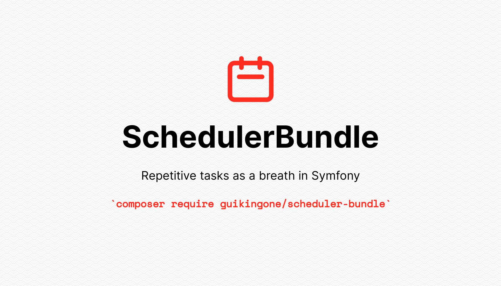

<div align="center">
    
    
    
    <a href="https://insight.symfony.com/projects/825be328-29f8-44f7-a750-f82818ae9111"></a>
    
    
    <br><br>Daily runs<br>
    <table>
        <tr>
            <th>Code style</th>
            <th>Infection</th>
            <th>PHPUnit</th>
            <th>Rector</th>
            <th>Security</th>
            <th>Static analysis</th>
        </tr>
        <tr>
            <td></td>
            <td></td>
            <td></td>
            <td></td>
            <td></td>
            <td></td>
        </tr>
    </table>
</div>

<h4 align="center">A Symfony bundle built to schedule/consume repetitive tasks</h4>

## Main features

- External transports (Doctrine, Redis, etc)
- External configuration storage (Doctrine, Redis, etc)
- Retry / Remove / Sort policies
- Background worker
- [Symfony/Messenger](https://symfony.com/doc/current/messenger.html) integration
- [Mercure](https://www.mercure.rocks) integration

## Installation

Make sure Composer is installed globally, as explained in the
[installation chapter](https://getcomposer.org/doc/00-intro.md)
of the Composer documentation.

```bash
$ composer require guikingone/scheduler-bundle
```

## Quick start

Once installed, time to update the `config/bundles.php`:

```php
// config/bundles.php

return [
    // ...
    SchedulerBundle\SchedulerBundle::class => ['all' => true],
];
```

Then [configure a transport](doc/transport.md) in `config/packages/scheduler.yaml`:

```yaml
# config/packages/scheduler.yaml
scheduler_bundle:
    transport:
        dsn: 'filesystem://first_in_first_out'
```

Finally, it's time to [create a simple task](doc/tasks.md):

```yaml
# config/packages/scheduler.yaml
scheduler_bundle:
    transport:
        dsn: 'filesystem://first_in_first_out'
    tasks:
        foo:
            type: 'command'
            command: 'cache:clear'
            expression: '*/5 * * * *'
            description: 'A simple cache clear task'
            options:
                env: test
```

When a task is configured, time to execute it, two approaches can be used:

- Adding a cron entry `* * * * * cd /path-to-your-project && php bin/console scheduler:consume >> /dev/null 2>&1`
- Launching the command `scheduler:consume --wait` in a background command

## Documentation

* [Usage](doc/usage.md)
* [Configuration](doc/configuration.md)
* [Best practices](doc/best_practices.md)
* [Tasks](doc/tasks.md)
* [Transports](doc/transport.md)
* [Lock](doc/lock.md)
* [Commands](doc/command.md)
* [Events](doc/events.md)
* [Lazy Loading](doc/lazy_loading.md)
* [Messenger](doc/messenger.md)
* [HTTP entrypoint](doc/http.md)
* [Policies](doc/policies.md)
* [Runners](doc/runners.md)
* [Worker](doc/worker.md)
* [Scheduler](doc/scheduler.md)
* [Middleware](doc/middleware.md)
* [Probe](doc/probe.md)
* [Tests](doc/test.md)
* [Mercure](doc/mercure.md)

# Contributing

Want to [improve](.github/CONTRIBUTING.md) this bundle?
