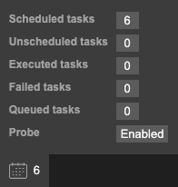
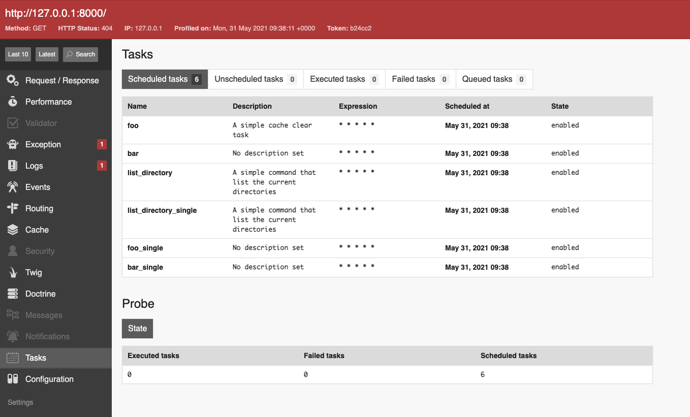
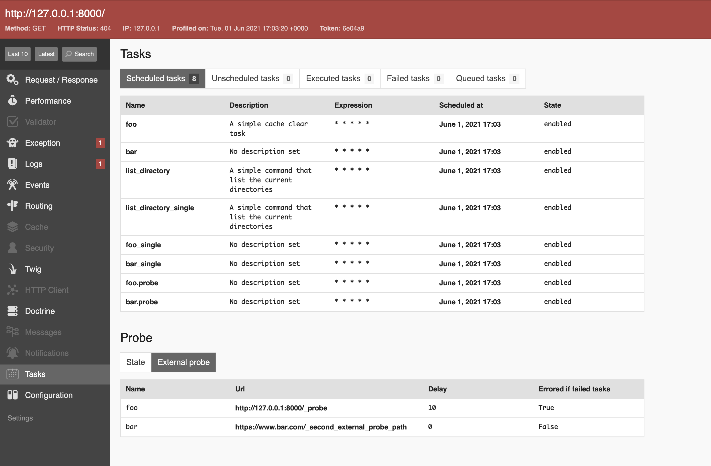

# Probe

This bundle provides a probe that helps to check the current tasks state
and fetch external applications state.

- [Returning current state](#returning-current-state)
- [Fetching external application state](#fetching-external-state)
- [DataCollector](#datacollector-integration)
- [Extending](#extending)

## Returning current state

First, the probe must be enabled and optionally a path (defaults to `/_probe`):

```yaml
scheduler_bundle:
    probe:
        enabled: true
        path: '/_probe'
```

Once done, the current state is returned as shown below when sending a `GET` request to the specified path:

```json
{
  "executedTasks": 5,
  "failedTasks": 0,
  "scheduledTasks": 1
}
```

The probe will return the following information:

- `executedTasks`: The count is done on the tasks executed during the latest minute.
- `failedTasks`: The count is done on the tasks that are marked as failed by the worker.
- `scheduledTasks`: The count is done on the tasks that have been scheduled.

## Fetching external state

Let's imagine that you use this bundle in multiple applications. 
Sometimes you may need to control the state of these applications. 
To do so, you can define a list of clients that will fetch these states:

```yaml
scheduler_bundle:
    probe:
        enabled: true
        path: '/_probe'
        clients:
            foo:
                externalProbePath: 'https://www.foo.com/_external_probe_path'
                errorOnFailedTasks: true # Define if the probe must fail when `failedTasks` is not equal to 0
                delay: 10 # Define a delay before sending the request (in milliseconds)
            bar:
                externalProbePath: 'https://www.bar.com/_second_external_probe_path'
                errorOnFailedTasks: false # Default value
```

By default, the bundle will define a `ProbeTask` for each client,
these probes are planned be executed every minute.
As this task is not executed in background, 
you must use the `scheduler:execute:external-probe` command to launch the probe clients.

**_Note: By default, the runner will return the task as failed if the response returns a 3/4/5xx status code._**

**_Notice: As each client is transformed into a `ProbeTask`, the name of the client is used as the task name with a `.probe` suffix
To prevent any errors when merging both probe clients and default tasks, using a unique name is highly recommended._**

## DataCollector integration

The probe is integrated in the debug toolbar thanks to [DataCollector](https://symfony.com/doc/current/profiler/data_collector.html#content_wrapper),
you can check the state of the probe via the toolbar:

<div align="center">
    
</div>

Then check the current probe state using the `Tasks` menu:

<div align="center">
    
</div>

You can also check the external probes state if configured (and **if at least a probe has been defined**):

<div align="center">
    
</div>

## Extending

// TODO
